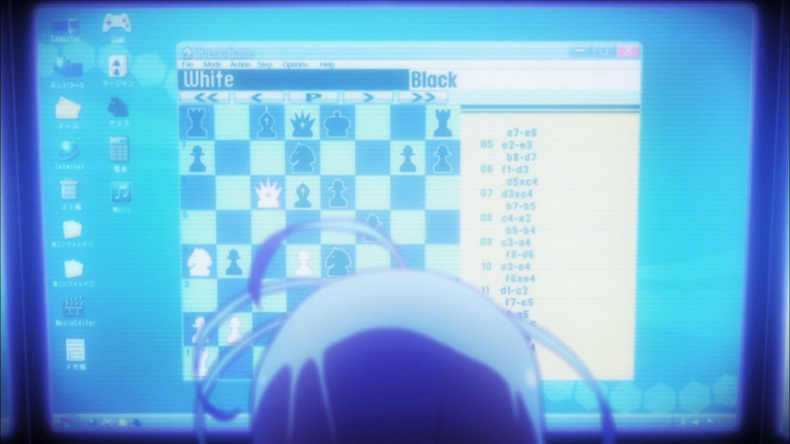
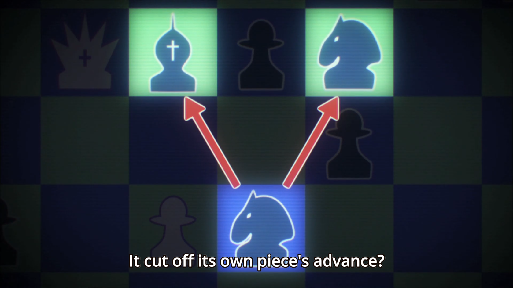
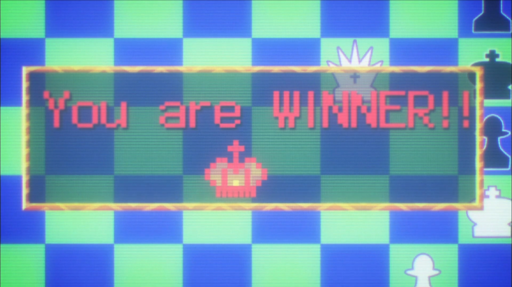
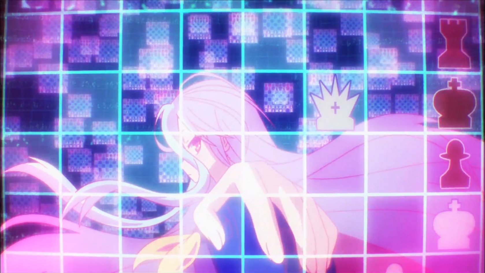

No Game No Life anime
===

# Episode 1
## [6:37](01-06-37.pgn)

Tet (black) challenges Shiro and Sora (white) to chess through an e-mail.
The move log is clearly visible on the right side of the chess program. When
replicating this move log and running it through a database, you can find out
that this game is actually from a [match](http://www.chessgames.com/perl/chessgame?gid=1411126) between two grandmasters – [Peter K
Wells](https://en.wikipedia.org/wiki/Peter_Wells_(chess_player)) and [Yoshiharu Habu](https://en.wikipedia.org/wiki/Yoshiharu_Habu) from 2005-10-24.

The following state is reached after the 13th move in the game.

The following state is reached after the 15th move. The current most advanced
chess engine (Stockfish&nbsp;10) rates the move as the best possible (depth 23), so
it is a move the engine would make. However, Shiro and Sora interpret this move
as a sign of a human player.

> Sora: A program will always select the best move, but black is deliberately
> using a bad move to lure you in. It's a human.

The only difference from the original chess match is the result. The game from
2005 ended by white resigning after the 28th move, because of the unavoidable
checkmate in two moves. [The PGN](01-06-37.pgn) contains a computer analysis of
the game and the remaining moves required to checkmate.

After a cut, we see Shiro and Sora totally exhausted from playing and we can
see that they have won at 7:34.

This state is a checkmate and a win for white. Peter Wells could use some advice from Shiro!

Interestingly enough, this last board state is also visible in the anime before
Shiro even starts playing. While she is being praised by Sora for understanding all of the possible 10^120 chess states, you can catch a glance of the following
image at 6:33.

# Episode 3 & 4

The chess game between Kuuhaku and Chlammy Zel is not a legitimate game of
chess as there are illegal moves present as soon as in the second move.
Therefore (and also because most moves aren't shown), this "war of morale",
rather than a chess match, won't be documented here.
