No Game No Life: Zero
===
by sorashi

# [01:02](00-01-02.pgn)

The movie starts with a game between Riku (white) and Tet (black). There are
only two plies shown – e4 e6. This opening is known as
[the French Defence](https://en.wikipedia.org/wiki/French_Defence).

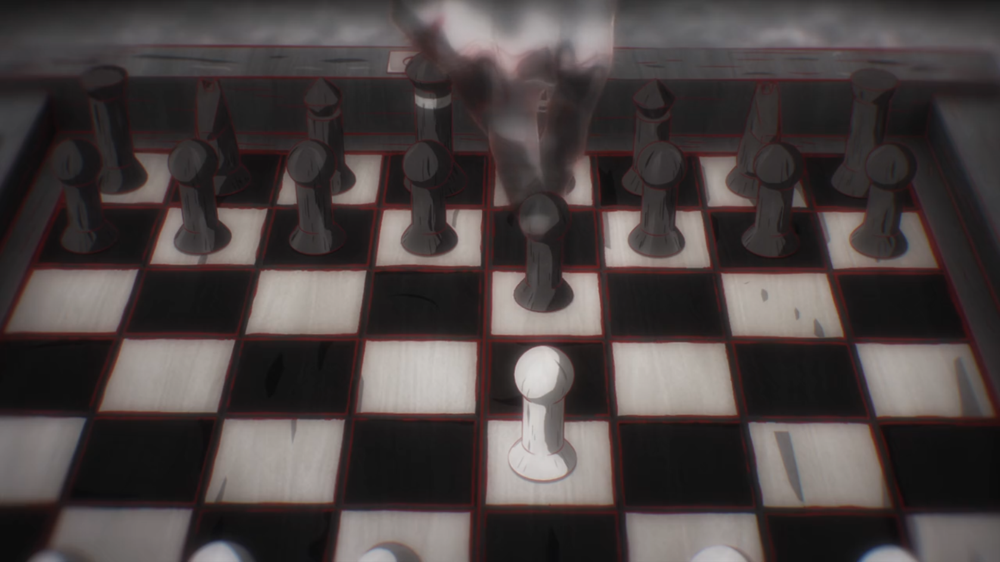

# 3:04

The board in this scene is very hard to see. The dialogue implies Tet (white)
has just checkmated Izuna (black) with his knight move. I tried my best
to reconstruct the state from what we can see and deduce.

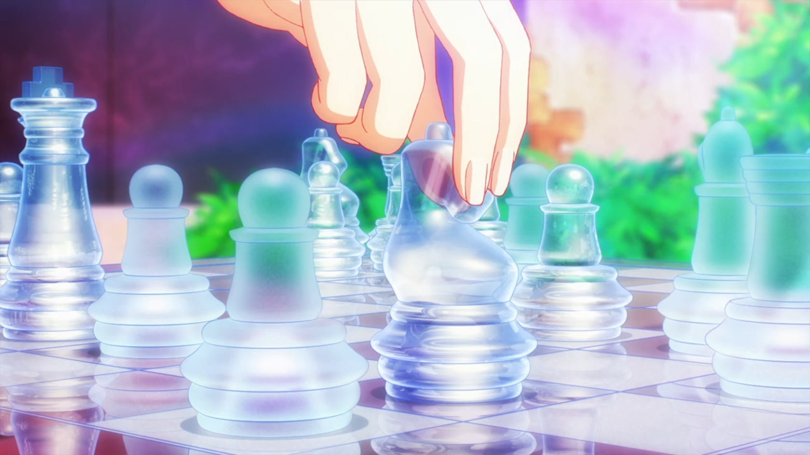

In the next few seconds however, with the "camera" position changed, it
looks like Tet and Izuna switched sides and the board is in a totally different
position:

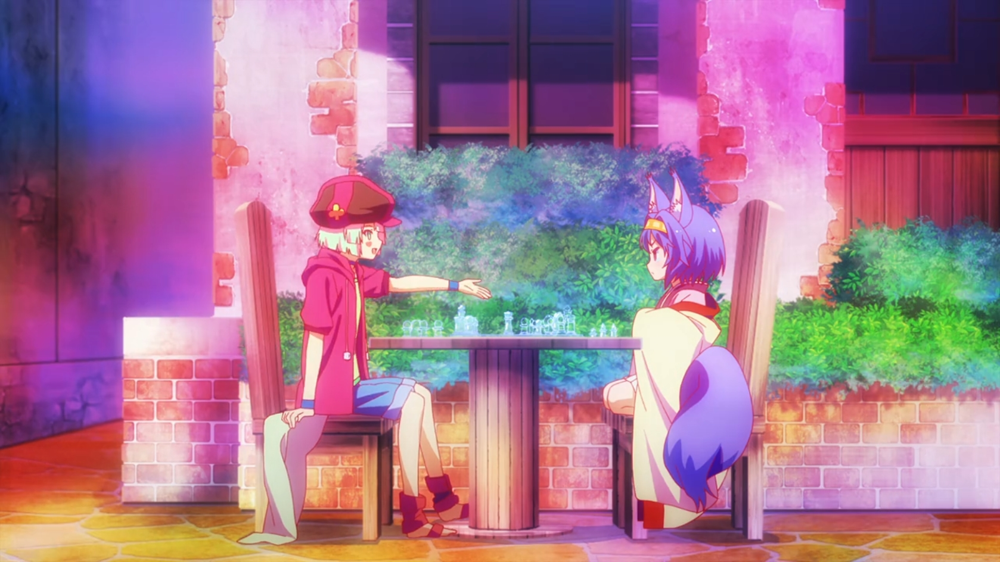

We're leaving this state as inconclusive.

# 32:31

Schwi (white) starts a game against Riku (black) while Riku brushes her hair.
There's only a single ply known from the starting position: e4 (King's Pawn).

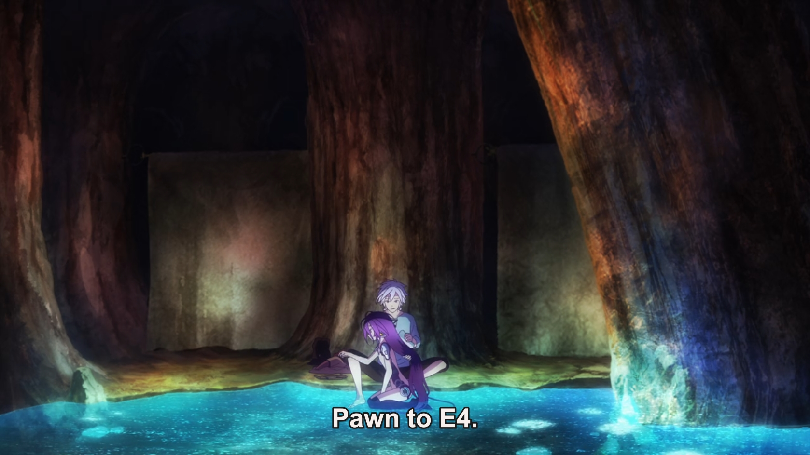

# [39:11](00-36-11.pgn)

Riku and Schwi play chess to wait out a storm. Only the last board position is
visible, which is a checkmate and a win for Schwi (black).

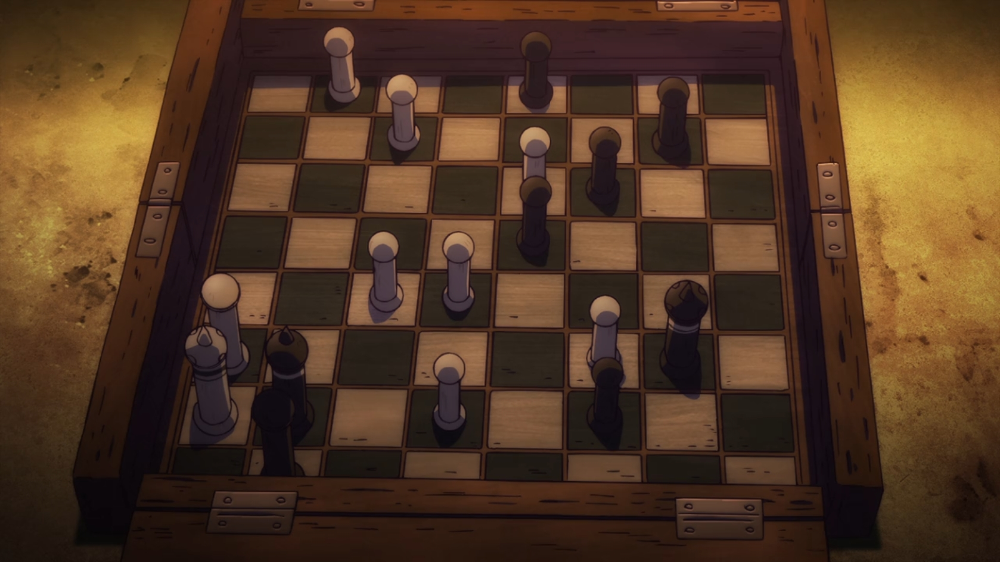

# [41:56](00-41-56.pgn)

Although Schwi indicates that Riku can't win against her (computational
abilites), Riku keeps playing. It is implied that multiple games (not visible
on-screen) had occured before this one.

The game starts with Nf3, which is
[the Zukertort Opening](https://en.wikipedia.org/wiki/Zukertort_Opening). The
PGN file classifies it as A04, although it might not be correct, due to the next
 ply not being visible on-screen.

The opening occurs at 39:27

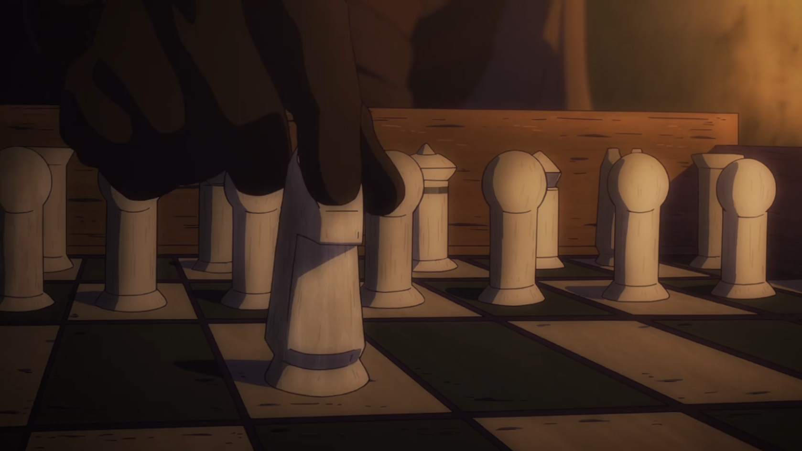

The end of the game occurs at 41:56 with the result of a checkmate and a next
win for Schwi (black). The last move is Qh4# (from e4). The full state of the
ending position is unknown. Some pieces may be missing.

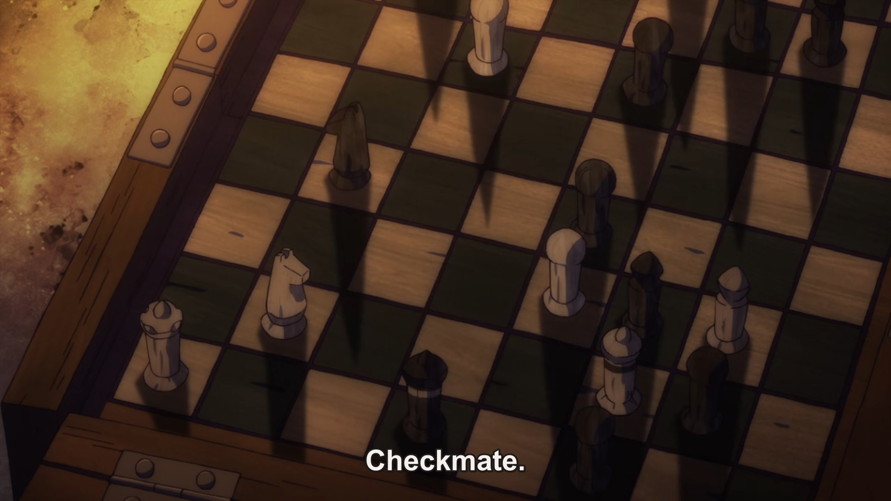

# 1:01:48

Riku (white) plays against Shinku Nilvalen (black) and resigns. Only a small
part of the board is visible.

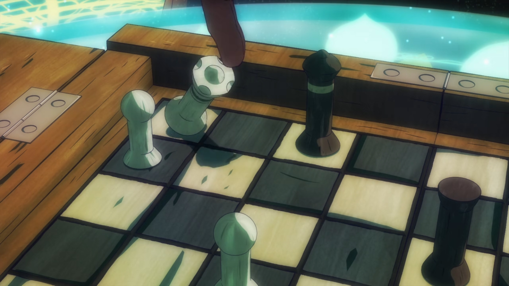

# [1:06:41](01-06-41.pgn)

Riku (white) plays against Schwi (black). Most of the board can be seen from the
two images. The whole white's position is not visible though. Only one ply is
visible – Schwi (black) does a5.

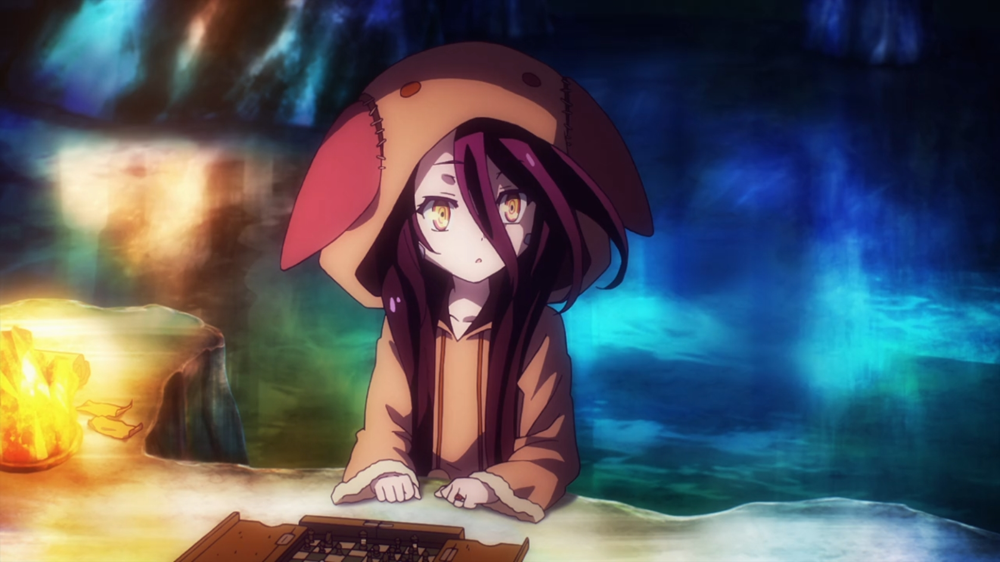

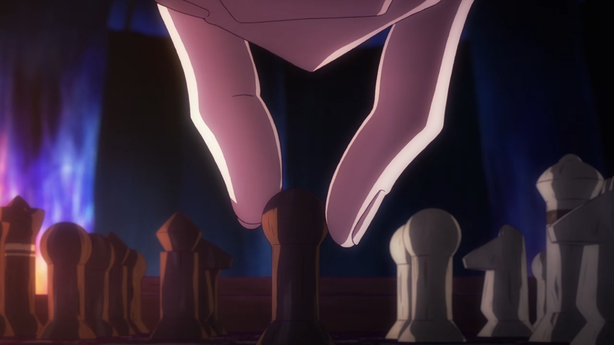

# [1:36:24](01-36-24.pgn)

As Corone makes the last move Riku (white) requested (Re6+) and falsely
interprets it as a checkmate, Tet (black) does Qf6 and realizes the game ends in
a draw due to perpetual check. The PGN includes all moves until the draw could
be claimed due to threefold repetition.

Initial state (before Re6+):

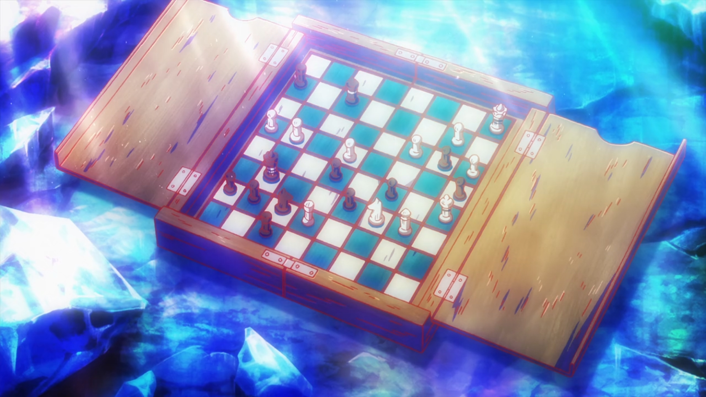

State after Tet's move:

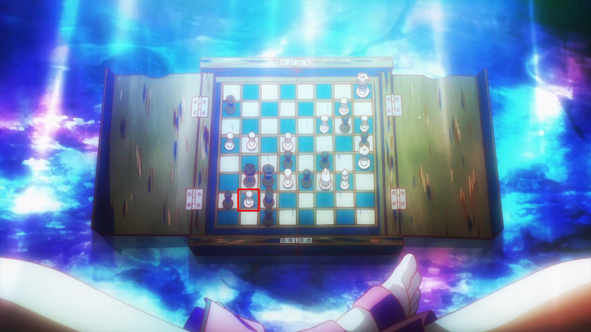

*Note: there's a mistake in the imagery – the g7 pawn changed color from black
to white. This wrong state that Tet reviews actually isn't a draw, but rather a
win for Tet as there's a possible forced checkmate in 6 moves. This wrong state
and resulting checkmate are available [here](01-36-24-wrong.pgn).*

The repetition goes from the correct state as follows: Ne7+ Kh6 Nf5+ Kg6

If white stopped checking the black king, black would win by doing Rh1#.

The game thus ends in a draw.

# [1:38:46](01-38-46.pgn)

As we slowly ease into the present from the beautiful prequel story, we are
presented with a glass chess set used in a game of Tet (white) against Izuna
(black). The state is a checkmate and a win for Tet.

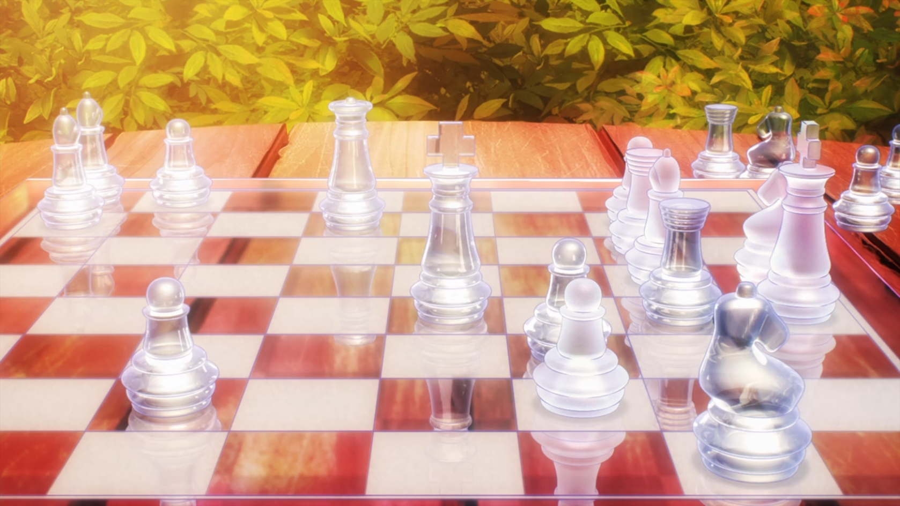

